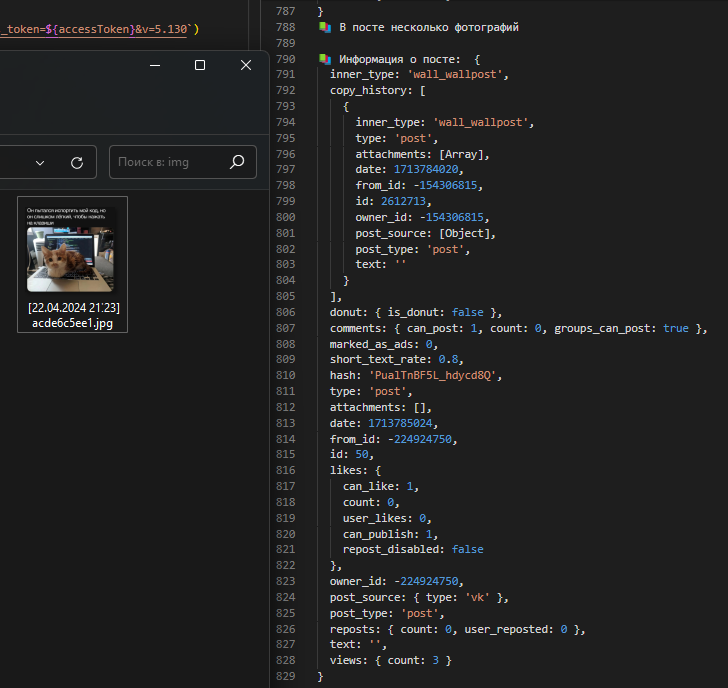

# Загрузчик постов из ВКонтакте 

**Описание на текущий момент не до конца актуально**

Эта программа написана на JS, и работает через официальное API ВКонтакте

Главная программа по загрузке всего контента из постов находится в файле 📗**main.js**📗

Дополнительная программа по загрузке видео по набору ссылок находится в файле 📘**video_downloader 2.js**📘

---

Эта программа в автоматическом режиме скачает и сохранит: Картинки, текст и GIF из всех постов из любого паблика ВКонтакте

Также, она получит ссылки на все видео из постов, и сохранит их в текстовый файл, с датами постов

Внутри программы можно выбрать с какого и до какого поста будет вестись загрузка. Также есть возможность идти до того момента, пока в группе не встретится опрос

_Пример работы программы:_

---

Это мой домашний проект. Я часто сохраняю мемы и публикации разной тематики (юмор, милые картинки, красивые фото, и т.д.) - в мои тематические группы, которые я веду. Это архивные паблики, которые я нигде не раскручиваю, и они у меня ведутся только для сортировки сохраняемогго контента.

Мне потребовалось сделать резервную копию всего контента, который накопился в этих пабликах. Контента получилось очень много, и вручную это было сделать практически нереально. И по этому я решил написать автоматизированный скрипт для таких целей

Сначала я получил access тоекен, для отправки запросов к API ВКонтакте, и начал писать отправку запросов

Далее, я выписывал получение фотографии из поста моей группы, и сохранение его как картинку в папку

После этого - добавил обработку даты поста, нескольких картинок, вложенных постов, и текста в посте

Дальше я сделал пакетную автоматическую обработку загрузки постов. Были опасения, что я выйду за лимит запросов в секунду, и меня (и мою страницу в ВК) заморозят на несколько дней, но я был аккуратен, и всё обошлось

После этого, я получил автоматический обработчик постов, который сохранял весь контент из любого паблика ВКонтакте, и мог работать в автоматическом режиме с самого первого поста, до самого последнего

Также, он создаёт много вложенных папок, что бы был порядок, даже если загрузка внезапно прервётся. А ещё он создаёт отдельные папки с назвнием session, датой и временем, до секунд. Так, папка не пересоздастся, и контент не перезапишется, в случае частого запуска этого скрипта

---

Дальше были небольшие проблемы с загрузкой видео и клипов. Я нашёл бесплатные сервисы (сайты), которые по ссылке скачивают видео из ВК. Я использовал автоматизацию открытия этого сайта, вставку ссылки, и загрузку файла - в виртуальном браузере, фактически и здесь автоматизировав себе всю рабту

Опытным путём были найдены нужные паузы в запросах, что бы такие сайты не блокировали меня, и не считали за робота

Полное сохранение контента из всех моих пабликов заняло несколько часов, но оно того стоило 🔥

Это мем с котиком, который пытается помешать программисту писать код, но он слишком лёгкий что бы нажать клавиши на клавиатуре 😸
Из моего паблика про программистов я обработал этот мем одним из первых ✨
